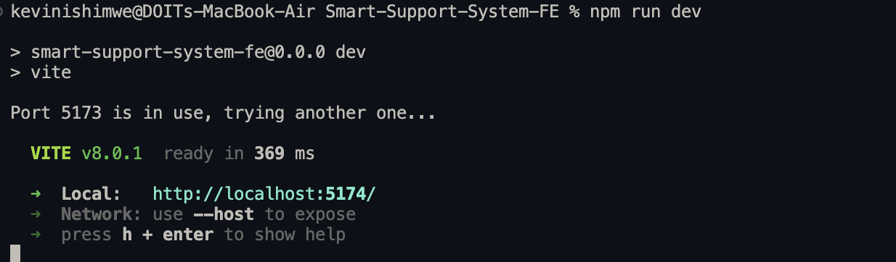

# Smart Support System


A customer support web app that helps teams resolve issues faster through streamlined communication and automated responses.

## FE Tech Stack

- **React** + **Vite**
- **Tailwind CSS v4**
- **React Router v6**

## Getting Started

### Prerequisites

- Node.js v18+
- npm or yarn
- git

### Setup

open terminal

```bash
git clone https://github.com/umbc-cmsc447-section1-1932-team2/Smart-Support-System-FE.git
```

```bash
cd Smart-Support-System-FE
```

to install dependencies run the

```bash
npm install
```

to start the development server

```bash
npm run dev
```



### Build for Production

```bash
npm run build
```

## Folder Structure

```
smart-support-system/
├── public/
├── src/
│   ├── components/
│   │   ├── (resusable components here)
│   ├── pages/
│   │   └── (web pages here)
│   ├── App.jsx              (Route definitions)
│   ├── main.jsx             (App entry point)
│   └── index.css            (# Global styles & Tailwind theme)
├── index.html
├── vite.config.js
└── package.json
```

---

## Theming

Custom colors are defined in `src/index.css` using Tailwind v4's `@theme` block:

| Token       | Value     | Usage                       |
| ----------- | --------- | --------------------------- |
| `primary`   | `#1949AD` | Buttons, links, brand color |
| `secondary` | `#1A3A8F` | Hover states, accents       |
| `offwhite`  | `#F4F8F9` | Page backgrounds            |

---

## Contributing

1. clone the repository
2. Create a feature branch: `git checkout -b ft-feature-name`
3. Rebase main branch: `git pull origin main --rebase`
4. Commit your changes: `git commit -m "discriptive commit message"`
5. Push to the branch: `git push origin ft-feature-name`
6. Once ready squash commits : `rebase -i HEAD~N` N number of commits
7. Open a pull request

---

_Team 2_

- kevin Ishimwe
- gabrielle sarong
